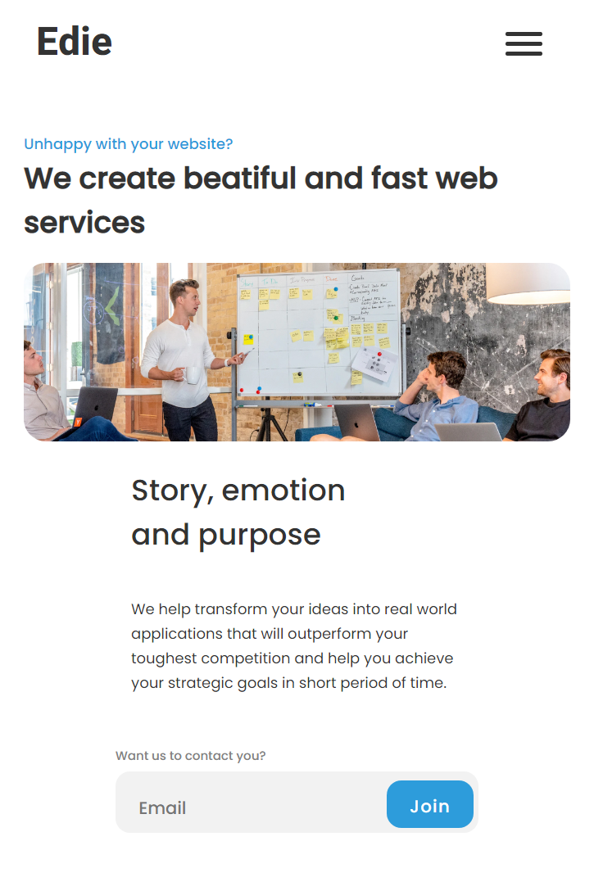
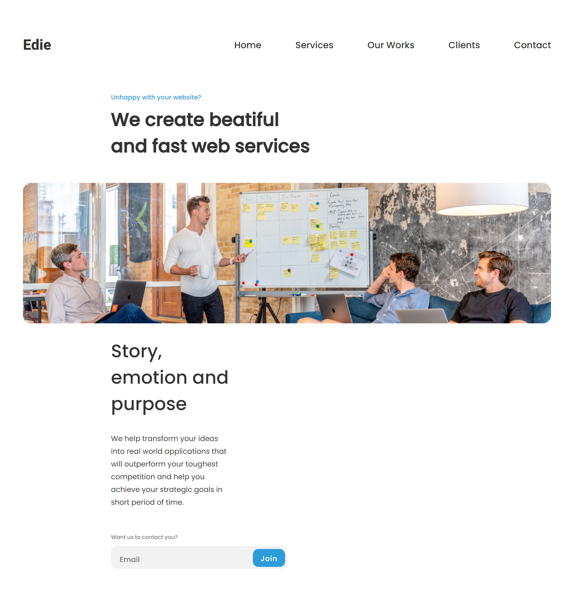

<!-- Please update value in the {}  -->

<h1 align="center">Devchallenges: Edie Homepage</h1>

<div align="center">
   Solution for a challenge from  <a href="http://devchallenges.io" target="_blank">Devchallenges.io</a>.
</div>

<div align="center">
  <h3>
    <!-- <a href="https://{your-demo-link.your-domain}">
      Demo
    </a> -->
    <span> | </span>
    <a href="https://github.com/islandskan/devchallenges-responsive-edie-homepage">
      Solution
    </a>
    <span> | </span>
    <a href="https://devchallenges.io/challenges/xobQBuf8zWWmiYMIAZe0">
      Challenge
    </a>
  </h3>
</div>

<!-- TABLE OF CONTENTS -->

## Table of Contents

-   [Overview](#overview)
-   [Challenges](#challenges)
-   [Solutions](#solutions)
-   [Issues to solve](#issues-to-solve)
-   [Features](#features)
-   [How to use](#how-to-use)
-   [Built with](#built-with)
-   [Contact](#contact)
-   [Acknowledgements](#acknowledgements)

<!-- OVERVIEW -->

## Overview




My submission to project 7/8, as part of Devchallenge's learning path 'Responsive Web Developer'. The project features the homepage of a fictious web team Edie. The main challenge consisted of creating a static, responsive page with HTML and CSS based on the provided Figma design. Resources such as images and the favicon was provided in the starter files.

The user stories:

-   I can see a page following the given design
-   I can see a page on mobile following the given design
-   I can go to certain locations by selecting links in navigation or footer

Other than the user stories and the main challenge, I also challenged myself with: - Functional mobile navigation with JavaScript - Cleaning up the CSS code - Bundling and minifying the project using Parcel.js

### Challenges

-   Getting the autoprefixer plugin to work(since Parcel comes with PostCSS)
-   Getting the layout for screen width 768px and greater to work
-   Cleaning up the classnames to make the CSS selectors more reusable and more effective

### Solutions

-   When the mobile navbar is open, I wanted the burger button to be fixed(so that you can close the mobile navbar even when you have 'scrolled down'). I solved this by adding the classname '.fixed' to the burger button when the nav element had the '.open' classname present.
-   Learned to use Parcel.js to bundle and minify the files

### Issues to solve

-   When the mobile navbar is open(and covering the whole screen), I want the user to only be able to focus on the items in the navbar. I want to implement this because even when the mobile navbar is covering up the screen, you can still tab the elements that are 'under' the mobile navbar(even though you can't see them).
-   Even though the links in the mobile navbar is fading in just like I wanted, there's still a problem. If I close and open the mobile navbar too quickly, the last links hasn't finished their transition. This causes the animation to be yanky.

## Features

-   Responsive web design, smallest screen width 320px, up to at least 1440px screen width.
-   Responsive mobile menu
-   Animated mobile burger menu
-   When mobile menu is opened, the links are fading in from top to bottom
-   Custom focus ring on interactive elements such as buttons, links, and input fields

## How To Use

<!-- Example: -->

To clone and run this application, you'll need [Git](https://git-scm.com) and [Node.js](https://nodejs.org/en/download/) (which comes with [npm](http://npmjs.com)) installed on your computer. From your command line:

```bash
# Clone this repository
$ git clone https://github.com/islandskan/devchallenges-responsive-edie-homepage

# Install dependencies
$ npm install

# Run the app
$ npm start
```

### Built with

-   [Parcel](https://parceljs.org/)

## Contact

-   GitHub [@islandskan](https://github.com/islandskan)
-   LinkedIn [Sigridur Eggertsdottir](https://www.linkedin.com/in/sigridureggertsdottir/)

## Acknowledgements

-   [Steps to replicate a design with only HTML and CSS](https://devchallenges-blogs.web.app/how-to-replicate-design/)
-   [Node.js](https://nodejs.org/)
-   [Marked - a markdown parser](https://github.com/chjj/marked)
-   [Mdn Web Docs - classList.toggle()](https://developer.mozilla.org/en-US/docs/Web/API/Element/classList)
-   [Dev Ed - Animated Responsive Navbar Tutorial](https://www.youtube.com/watch?v=H4MkGzoACpQ)
-   [Mdn Web Docs - Event, transitionend](https://developer.mozilla.org/en-US/docs/Web/API/Element/transitionend_event)
